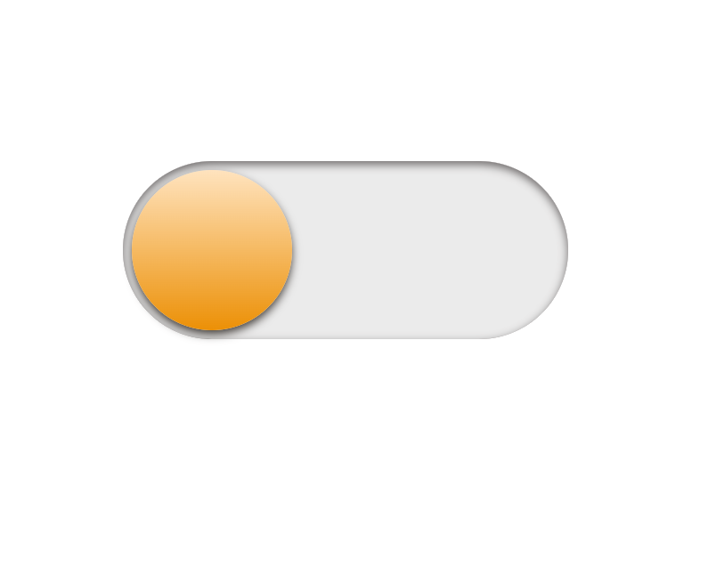
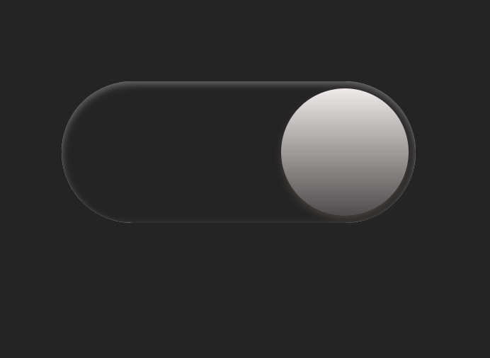

🌗 Dark Mode Toggle UI

A beautifully animated dark mode toggle switch built with pure **HTML** and **CSS** — no JavaScript required!  
Inspired by minimal UI design and gradient-based aesthetics, this toggle mimics a sun/moon switch and smoothly transitions between light and dark themes.

---

✨ Features

- 🔘 Pure CSS toggle switch
- 🎨 Smooth animated transitions
- 🌞 Light & 🌚 Dark themes
- 💡 Easily customizable design
- 📱 Fully responsive for all screen sizes

---

## 🛠️ How It Works

- Uses an `input[type="checkbox"]` to manage toggle state.
- `label` styled as a pill switch with a circle using `::after`.
- CSS `:checked` selector is used to trigger dark mode background and shift the toggle.
- Responsive layout with Flexbox centering.

---
